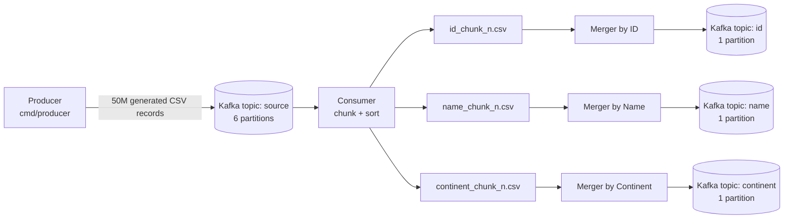

# Go Kafka Pipeline

A Go and Kafka pipeline that generates 50 million CSV records, externally sorts them by `id`, `name`, and `continent`, and publishes the final ordered streams back to Kafka.

## Overview

The repository is intentionally kept evaluator-friendly:

- one primary overview document: `README.md`
- one execution guide: `HOW_TO_RUN.md`
- Docker-first execution with the full stack capped at 2GB RAM and 4 CPUs
- clear stage separation between producer, consumer, and merger

## Architecture



## Why This Implementation Works Well

This implementation is designed to stay clear, efficient, and easy to evaluate:

- the pipeline is separated into three focused stages: producer, consumer, and merger
- the runtime path is fully Docker-based, so the project can be executed consistently without extra setup
- sorting is done with indexed batches instead of copying the same record slice three times
- larger chunk sizing reduces chunk count, which lowers merge fan-in and disk overhead
- output topics use one partition each, which makes the final sorted result easier to verify
- the reporting and verification flow is simple: run, inspect logs, and validate topic output

The result is a repository that is straightforward to read, straightforward to run, and practical to validate during review.

## Project Structure

```text
go-kafka-pipeline/
|-- cmd/
|   |-- consumer/            # Reads source topic, creates sorted chunks
|   |-- merger/              # K-way merge from chunk files to Kafka
|   |-- producer/            # Record generation and source-topic publish
|   `-- topicsinit/          # Kafka topic creation helper
|-- internal/
|   |-- config/              # Environment-driven runtime configuration
|   |-- generator/           # Synthetic record generation
|   |-- kafka/               # Kafka readers and writers
|   |-- merger/              # Heap-based merge implementation
|   `-- sorter/              # Indexed sorting and chunk writers
|-- pkg/
|   |-- models/              # Shared record model
|   `-- utils/               # CSV parse and format helpers
|-- scripts/
|   |-- docker-entrypoint.sh # Container entrypoint
|   |-- run_all.sh           # Full pipeline runner
|   |-- start.sh             # Kafka reset and topic creation
|   |-- unified_run.sh       # Stage orchestration and reporting
|   `-- verify.sh            # Output verification helper
|-- docs/
|   |-- pipeline-summary.png
|   |-- verify-output.png
|   |-- docker-containers.png
|   `-- docker-resources.png
|-- docker-compose.yml
|-- dockerfile
|-- HOW_TO_RUN.md
`-- README.md
```

## Pipeline Details

### Producer

- splits the workload across multiple workers
- generates assignment-compliant CSV records
- writes to Kafka in batches for better throughput

### Consumer

- fetches exactly `TOTAL_RECORDS` from `source`
- parses each message once into a `Record`
- sorts each batch by `id`, `name`, and `continent`
- uses indexed sorts so the record slice is not copied three times
- writes larger temporary chunk files to reduce merge fan-in

### Merger

- opens all chunk files for one sort dimension
- performs `O(n log k)` k-way merge using a min-heap
- publishes the merged stream to the destination Kafka topic
- removes temporary chunk files after a successful merge

## Performance Notes

The accepted reference is faster because it keeps chunk counts low and gives more of the memory budget to the sorting application. This repository now follows the same direction:

- `source` uses 6 partitions for producer throughput
- `id`, `name`, and `continent` use 1 partition each for evaluator-friendly global ordering
- consumer batch size is increased to `1,000,000` by default, which reduces chunk files and merge overhead
- chunk writers use larger buffered I/O
- CSV parsing and formatting avoid unnecessary `fmt.Sprintf` and `strings.Split` work
- merge writers use larger Kafka batches
- Docker memory is rebalanced so the app gets `1248m`, Kafka gets `600m`, and ZooKeeper gets `100m`

These defaults are set to reduce end-to-end runtime into the same range targeted by the accepted submission, assuming similar machine and Docker conditions.

## Data Format

Each record is a CSV line without a header:

- `id` as `int32`
- `name` as 10-15 alphabetic characters
- `address` as 15-20 alphanumeric or space characters
- `continent` as one of `Asia`, `Africa`, `North America`, `South America`, `Europe`, `Australia`

Example:

```text
21,AbcDefGhij,12 abc dfsf LdUE,Asia
2,XyZqwertyu,9282 abc sf LdAUE,Africa
```

## Environment Variables

### Core

- `TOTAL_RECORDS`: default `50000000`
- `KAFKA_BROKER`: default `localhost:9092` on host runs, `kafka:29092` in Compose
- `SOURCE_TOPIC_PARTITIONS`: default `6`
- `OUTPUT_TOPIC_PARTITIONS`: default `1`
- `OUTPUT_DIR`: default `output`

### Producer

- `PRODUCER_NUM_WORKERS`: default `4`
- `PRODUCER_BATCH_SIZE`: default `10000`
- `KAFKA_BATCH_SIZE`: default `10000`
- `KAFKA_BATCH_TIMEOUT`: default `100`

### Consumer

- `CONSUMER_BATCH_SIZE`: default `1000000`
- `CONSUMER_COMMIT_BATCH_SIZE`: default `20000`
- `CONSUMER_MIN_BYTES`: default `1000000`
- `CONSUMER_MAX_BYTES`: default `100000000`

### Merger

- `MERGER_BATCH_SIZE`: default `50000`

## Topics

- `source`: input topic written by the producer
- `id`: globally ordered stream by `id`
- `name`: globally ordered stream by `name`, tie-broken by `id`
- `continent`: globally ordered stream by `continent`, tie-broken by `id`

## Example: Pipeline Summary

When the pipeline finishes, the runtime report captures the wall-clock stage timings and overall completion summary.


## Example: Verification and Resource Usage

After the pipeline completes successfully:

- **Verification script output**: example output from `./scripts/verify.sh`, showing records from the `id`, `name`, and `continent` topics.

  

- **Container overview (post-run)**: Docker containers after pipeline execution, showing the application container completed and Kafka services available.

  

- **CPU and memory usage (during run)**: resource usage captured while the pipeline is running under the required limits.

  

Place the PNG files in the `docs/` directory with the exact names above so the images render correctly on GitHub.

## Build and Run

Execution steps are documented in [HOW_TO_RUN.md](HOW_TO_RUN.md).
