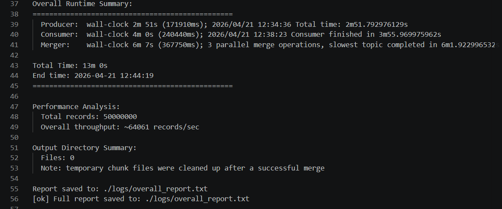
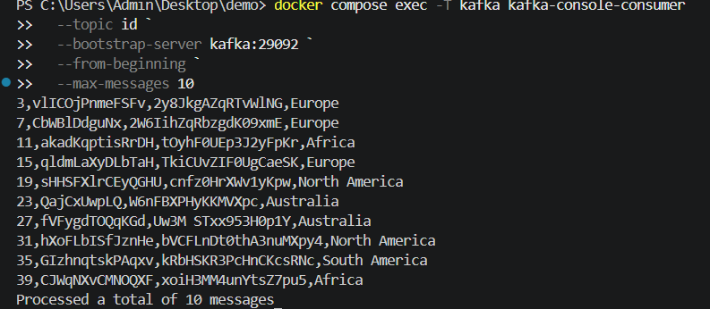
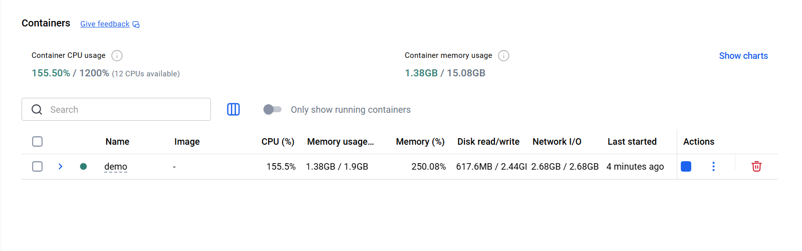
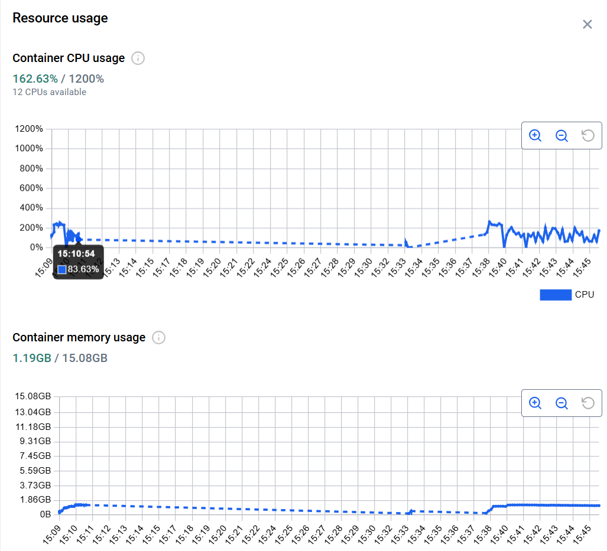

# Kafka CSV Sorting Pipeline

A Docker-first data pipeline built with Go and Apache Kafka. The system generates synthetic CSV records, publishes them to Kafka, sorts them externally in bounded batches, and merges the results into three output topics.

## Overview

The pipeline architecture includes:

- **Producer**: generates CSV records and publishes them to the Kafka `source` topic
- **Consumer**: reads `source`, sorts bounded batches by multiple keys, and writes sorted chunk files to disk
- **Merger**: performs k-way merge on chunk files and publishes the merged streams to Kafka topics `id`, `name`, and `continent`
- **Kafka + ZooKeeper**: provide the message broker layer used by all stages
- **Docker Compose**: runs the full stack with resource limits and mounted output/log directories

## Architecture

See [ARCHITECTURE.md](ARCHITECTURE.md) for the detailed design, bottlenecks, and scaling notes.


```text
Producer
  -> Kafka topic: source
Consumer
  -> output/id_chunk_*.csv
  -> output/name_chunk_*.csv
  -> output/continent_chunk_*.csv
Merger
  -> Kafka topic: id
  -> Kafka topic: name
  -> Kafka topic: continent
```

## Features

- **External sorting with bounded memory**: processes records in batches and spills sorted chunk files to disk
- **Indexed multi-key sorting**: sorts by `id`, `name`, and `continent` using index arrays instead of copying the full batch three times
- **Parallelized hot paths**: producer workers run concurrently, each chunk is sorted three ways in parallel, and the merger publishes three streams in parallel
- **Docker-first execution**: the pipeline container waits for Kafka, initializes topics, and runs the full flow automatically
- **Rerunnable workflow**: helper scripts reset Kafka, recreate topics, and clean generated artifacts for a fresh run
- **Runtime reporting**: stage logs plus a consolidated report are written to `logs/overall_report.txt`

## Project Structure

```text
kafka-pipeline/
|-- cmd/
|   |-- producer/            # Producer entrypoint
|   |-- consumer/            # Batch reader + chunk sorter entrypoint
|   |-- merger/              # K-way merge entrypoint
|   |-- topicsinit/          # Topic creation helper
|   `-- test/                # Local test utility
|-- internal/
|   |-- config/              # Environment-driven runtime config
|   |-- generator/           # Synthetic record generation
|   |-- kafka/               # Kafka readers and writers
|   |-- merger/              # Heap merge implementation
|   `-- sorter/              # Indexed sorting and chunk writers
|-- pkg/
|   |-- models/              # Shared record model
|   `-- utils/               # CSV parse/format helpers
|-- scripts/
|   |-- docker-entrypoint.sh # Container entrypoint
|   |-- run_all.sh           # Full pipeline runner
|   |-- start.sh             # Kafka reset + topic creation
|   |-- unified_run.sh       # Stage orchestration + reporting
|   `-- verify.sh            # Quick sample verification
|-- docs/
|   |-- architecture.png     # Architecture diagram
|   |-- pipeline-summary.png # Final runtime summary screenshot
|   |-- verify-output.png    # Verification output screenshot
|   |-- docker-containers.png # Containers view after run
|   `-- docker-resources.png # CPU and memory usage screenshot
|-- dockerfile               # Multi-stage Docker image
|-- docker-compose.yml       # Kafka + ZooKeeper + pipeline stack
|-- ARCHITECTURE.md          # Detailed architecture notes
|-- DOCKER_GUIDE.md          # Docker build and run guide
|-- VERIFICATION.md          # Verification commands
`-- README.md                # This file
```

## Technology Stack

- **Language**: Go 1.23
- **Message Broker**: Apache Kafka
- **Coordinator**: ZooKeeper
- **Container Runtime**: Docker
- **Orchestration**: Docker Compose
- **Runtime Base Image**: Alpine Linux

## Dependencies

- `github.com/segmentio/kafka-go` - Kafka client library

## Data Format

Records are raw CSV lines without a header and use the following fields:

- `id` (`int32`)
- `name` (`string`, 10-15 alphabetic characters generated by the app)
- `address` (`string`, 15-20 characters using letters, digits, and spaces)
- `continent` (one of `Asia`, `Africa`, `North America`, `South America`, `Europe`, `Australia`)

Example:

```text
21,AbcDefGhij,12 abc dfsf LdUE,Asia
2,XyZqwertyu,9282 abc sf LdAUE,Africa
```

## Environment Variables

### Shared

- `KAFKA_BROKER`: Kafka broker address. Default is `localhost:9092` for host runs and `kafka:29092` in Docker Compose
- `TOTAL_RECORDS`: total number of records to generate. Default: `50000000`
- `OUTPUT_DIR`: directory for chunk files. Default: `output`
- `TOPIC_PARTITIONS`: partition count used when topics are created. Default: `4`
- `SOURCE_TOPIC`: source topic name. Default: `source`
- `ID_TOPIC`: output topic for ID-ordered data. Default: `id`
- `NAME_TOPIC`: output topic for name-ordered data. Default: `name`
- `CONTINENT_TOPIC`: output topic for continent-ordered data. Default: `continent`
- `KAFKA_BATCH_SIZE`: kafka-go writer batch size. Default: `5000`
- `KAFKA_BATCH_TIMEOUT`: kafka-go writer batch timeout in milliseconds. Default: `50`

### Producer

- `PRODUCER_NUM_WORKERS`: concurrent producer workers. Default: `4`
- `PRODUCER_BATCH_SIZE`: records accumulated by a producer worker before writing. Default: `10000`
- `NUM_WORKERS`: legacy fallback for producer worker count
- `BATCH_SIZE`: legacy fallback for producer batch size

### Consumer

- `CONSUMER_MIN_BYTES`: minimum Kafka fetch size. Default: `100000`
- `CONSUMER_MAX_BYTES`: maximum Kafka fetch size. Default: `50000000`
- `CONSUMER_NUM_WORKERS`: chunk-processing workers. Default: `1`
- `CONSUMER_BATCH_SIZE`: records per chunk. Default: `200000`
- `CONSUMER_GROUP_ID`: Kafka consumer group id. Default: generated per run
- `CONSUMER_IDLE_TIMEOUT_SECS`: read timeout before retry/stop logic kicks in. Default: `10`
- `CONSUMER_IDLE_MAX_ATTEMPTS`: number of idle retries before failing early. Default: `6`

### Merger

- `MERGER_BATCH_SIZE`: messages per merge writer flush cycle. Default: `20000`

## Topics

- **source**: input topic containing generated CSV records
- **id**: merged stream ordered by `id` before Kafka partitioning
- **name**: merged stream ordered by `name` before Kafka partitioning
- **continent**: merged stream ordered by `continent` before Kafka partitioning

By default, topic creation uses `TOPIC_PARTITIONS=4` for all topics. Kafka preserves ordering within each partition, not across the whole topic. If you need strict single-stream global ordering in Kafka itself, use a single partition.

## Building and Running

See [DOCKER_GUIDE.md](DOCKER_GUIDE.md) for Docker details and [VERIFICATION.md](VERIFICATION.md) for validation commands.

### Option 1: Docker Compose

Run the full stack:

```bash
docker compose up --abort-on-container-exit --exit-code-from pipeline
```

This starts ZooKeeper, Kafka, and the `pipeline` container. The container waits for Kafka, ensures topics exist, clears generated artifacts from mounted folders, and runs the producer, consumer, and merger automatically.

Generated artifacts:

- chunk files in `output/`
- stage logs in `logs/`
- consolidated report in `logs/overall_report.txt`

### Option 2: Host Run

Run the complete pipeline from the host:

```bash
./scripts/run_all.sh
```

This script can start the Kafka stack for you and then calls `scripts/unified_run.sh` to run the three stages in sequence.

### Build

Local Go build:

```bash
go build ./...
```

Docker image build:

```bash
docker build -t kafka-pipeline:latest .
```

## Example: Runtime Report

After a successful run, the orchestrator writes:

- per-stage logs to `logs/producer.log`, `logs/consumer.log`, and `logs/merger.log`
- a wall-clock summary and throughput estimate to `logs/overall_report.txt`



## Algorithm Details

### Producer

- Splits `TOTAL_RECORDS` across multiple goroutines
- Assigns non-overlapping ID ranges to workers so generated records stay unique
- Generates records in memory and publishes them to Kafka in batches

### Consumer

**Stage 1: Chunking and sorting**

- Reads from Kafka topic `source`
- Collects up to `CONSUMER_BATCH_SIZE` records into memory
- Sorts the same batch three ways using index arrays:
  - by `id`
  - by `name`
  - by `continent`
- Writes chunk files to:
  - `output/id_chunk_<n>.csv`
  - `output/name_chunk_<n>.csv`
  - `output/continent_chunk_<n>.csv`

### Merger

**Stage 2: K-way merge**

- Opens all chunk files for one sort dimension
- Uses a min-heap to merge the files in sorted order
- Publishes the merged stream to the corresponding Kafka topic
- Runs merges for `id`, `name`, and `continent` in parallel

## Performance Considerations

- **Memory usage**: primarily controlled by `CONSUMER_BATCH_SIZE`, `CONSUMER_NUM_WORKERS`, and the single queued batch channel in the consumer
- **Producer throughput**: scales with `PRODUCER_NUM_WORKERS` and `PRODUCER_BATCH_SIZE`
- **Merge throughput**: controlled by `MERGER_BATCH_SIZE` and Kafka broker write performance
- **Parallel CPU work**: each chunk sorts `id`, `name`, and `continent` concurrently
- **Resource cap**: Docker Compose limits the full stack to about **2GB RAM** and **4 CPU cores**

Current Compose limits:

- `zookeeper`: `256m`, `0.50` CPU
- `kafka`: `1g`, `1.50` CPU
- `pipeline`: `768m`, `2.00` CPU

## Optimizations Applied

- **Producer**: multiple generator workers with disjoint ID ranges
- **Consumer**: indexed sorting to avoid three copied record slices per batch
- **Consumer**: bounded in-flight work with one queued batch by default
- **Merger**: heap items cache both parsed records and original CSV lines to avoid extra formatting during publish
- **Operations**: container entrypoint waits for Kafka and runs topic initialization automatically

## Bottlenecks and Scaling

- **Kafka I/O**: producer and merger throughput are bounded by broker write speed
- **Disk I/O**: chunk creation and merge rereads generate substantial local disk traffic
- **Sort CPU**: each batch performs three comparison-based sorts
- **Topic ordering semantics**: multi-partition output topics improve throughput but do not give whole-topic global order

If you need to scale further:

- increase partitions and tune worker counts
- move producer and pipeline workloads onto separate machines
- place chunk storage on faster disks
- split merge work across dedicated workers or nodes
- reduce partition count when strict Kafka ordering matters more than throughput

## Verification

### Option 1: Quick Check

Run the helper script:

```bash
./scripts/verify.sh
```

### Option 2: Detailed Verification

See [VERIFICATION.md](VERIFICATION.md) for:

- topic existence checks
- record count checks
- chunk file validation
- sample ordering checks
- runtime report inspection

For the strongest ordering validation, inspect chunk files or use a single partition for output topics.

## Example: Verification and Resource Usage

After the pipeline completes successfully:

- **Verification script output**: capture the terminal output from `./scripts/verify.sh`, or equivalent Kafka sample output showing records from `id`, `name`, and `continent`

  

- **Container overview (post-run)**: capture Docker Desktop or an equivalent view showing `zookeeper` and `kafka` running and the `pipeline` container exited successfully

  

- **CPU and memory usage (during run)**: capture the Docker Desktop resource graph or equivalent monitoring view while the pipeline is actively running

  

Place the PNG files in the `docs/` directory with the exact names above so the images render correctly on GitHub.
